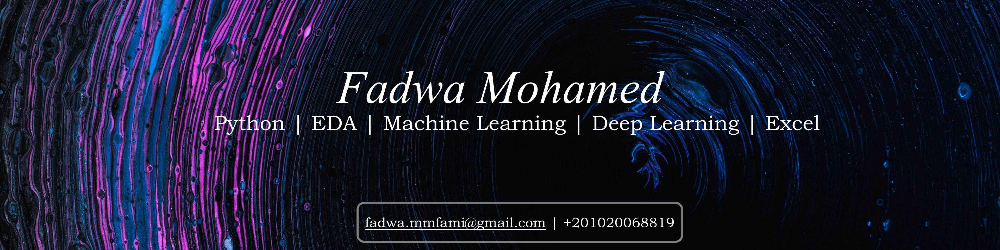

## Hello 👋 My name is Fadwa Mohamed
I'm a freelance data scienctist who is passionate about data storytelling and beautiful visualisations. I help clients discover insights from their data using python, machine learning, deep learning, SQL and excel. I'm detail-oriented and keen on delivering high quality work in a timely manner. I'm always keen on learning new tools and expanding my skillset, which I display in my portfolio right here on GitHub. 

**Skills**: ML, DL, SQL, Python, Excel, EDA, Statistics, Data Visualisation, Data Storytelling, Spark.  

---

Find me on:    
